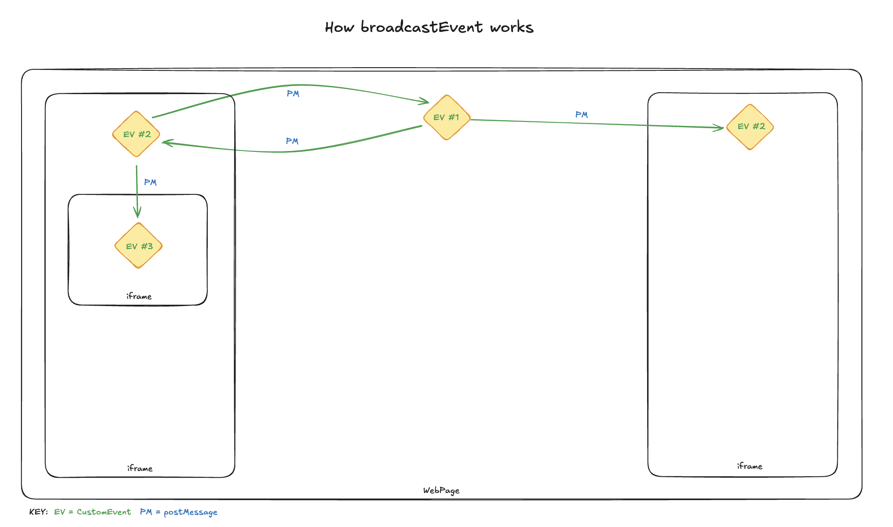

# broadcast-event

A simple way to fire JavaScript events across iframes.

## Motivation

[Orca Scan](https://orcascan.com) uses [CustomEvent](https://developer.mozilla.org/en-US/docs/Web/API/CustomEvent/CustomEvent) to fire app lifecycle events such as `app:ready` in our apps. Trouble is only handlers in the current page get the event, an event handler in an frame never recieves the event. 

`broadcastEvent(eventName, eventData, options)` was created to solve that problem.

```js
/**
 * @param {string} eventName - event to dispatch
 * @param {object} [eventData={}] - optional data to send
 * @param {object} [options={}] - optional options ;)
 * @param {boolean} [options.debug=false] - console log if true (default false)
 * @param {string} [options.target=e.detail._originId] - if set, send event only to that frame
 * @returns {void}
 */
broadcastEvent(eventName, eventData, options);
```



## Usage

Add [broadcast-event.min.js](dist/broadcast-event.min.js) to all pages you want to broadcast/recieve an event:

### broadcast an event

From any page/iframe, broadcast an event to all:

```js
broadcastEvent('my:event', {
    firstName: 'Micky',
    lastName: 'Mouse'
});
```

### recieve an event

From within any page/iframe, listen for an event as normal:

```js
window.addEventListener('my:event', function(e) {

    // get the data sent with the event
    var eventData = e.detail;

    console.log(eventData);
});
```

#### event data

The following event data is included with every event and accessible via `e.detail`

```js
{
  _originId: '1sadfa3', // unique id for sending instance of broadcastEvent
  _targetId: '223eqw3', // optional originId of frame to target
  ...                   // your event data
}
```

### broadcast to a specific frame

There are times when you might want to respond to an event, the best way to do this is to pass the `_originId` of the event you recieved as the `target` of the next broadcast:

```js
// listen for an event
window.addEventListener('my:event', function(e) {

    // fire an event in the senders window
    broadcastEvent('my:event:ty', { message: 'Thanks!' }, { target: e.detail._originId });
});
```

All frames will participate is broadcasting the event, but will not fire it locally unless the `target` matches their `_originId`.

### debugging

To debug issues broadcasting events pass `{ debug: true }` as the event options:

```js
broadcastEvent('my:event', { firstName: 'Micky', lastName: 'Mouse' }, { debug: true });
```

Then open Dev Tools to see a console log of the broadcast flow:

```
broadcast-event[http://localhost/parent-with-iframe.html] sending "my:event" down
broadcast-event[http://localhost/iframe.html] received "my:event"
broadcast-event[http://localhost/iframe.html] sending "my:event" up
broadcast-event[http://localhost/iframe.html] sending "my:event" down
broadcast-event[http://localhost/parent-with-iframe.html] received "my:event"
broadcast-event[http://localhost/parent-with-iframe.html] suppressed "my:event"
broadcast-event[http://localhost/nested-iframe.html] received "my:event"
broadcast-event[http://localhost/nested-iframe.html] sending "my:event" up
broadcast-event[http://localhost/iframe.html] received "my:event"
broadcast-event[http://localhost/iframe.html] suppressed "app:ready
```

### Tests

We have a few unit tests to confirm stability, more will be added over time. To run the tests use:

```bash
cd broadcast-event
npm i
npm test
```

### Build

To build a new version of [broadcast-event.min.js](dist/broadcast-event.min.js) from source:
1. increase the version number in `package.json`
2. run `npm run build`

## Contribute

We Open Source code we think might help others, if you'd like to assist:

1. Fork it!
2. Create your feature branch: `git checkout -b my-new-feature`
3. Commit your changes: `git commit -m 'Add some feature'`
4. Push to the branch: `git push origin my-new-feature`
5. Submit a pull request 🙏

## Star the repo

Find this useful? Star the repo - it help us priorities open source tasks 🌟

## License

[MIT License](LICENSE) © Orca Scan - a [barcode app](https://orcascan.com) with simple [barcode tracking APIs](https://orcascan.com/guides?tag=for-developers).
